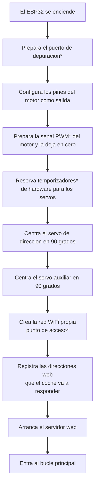
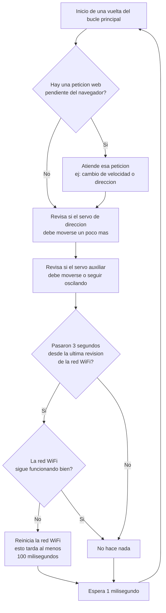
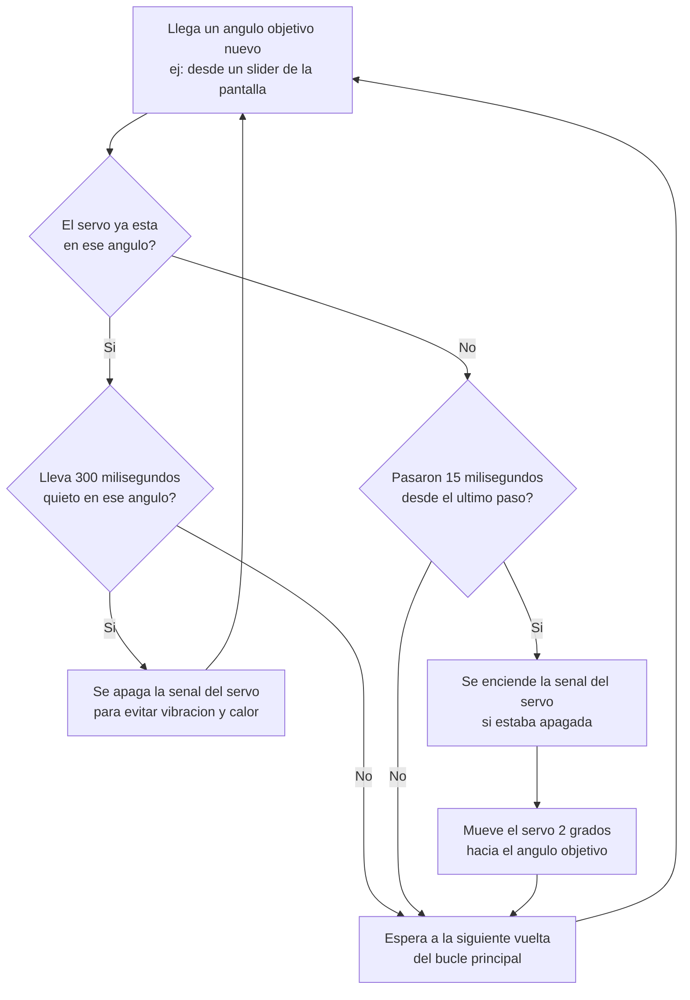
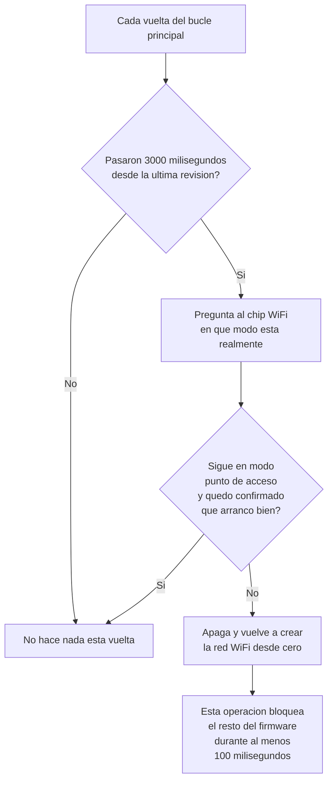

# CODIGO.md — Referencia técnica

Documentación de implementación de `src/main.cpp` para quien vaya a leer o modificar el firmware. Todos los rangos de línea y valores de esta página fueron verificados leyendo el archivo completo (652 líneas) tal como está hoy, no a partir de una versión anterior de este documento.

## Tabla de contenido

- [Arquitectura general](#arquitectura-general)
- [Organización del código](#organización-del-código)
- [Timers e intervalos](#timers-e-intervalos)
- [Máquina de estados: servos](#máquina-de-estados-servos)
- [Modo manual vs. automático del servo auxiliar](#modo-manual-vs-automático-del-servo-auxiliar)
- [Patrón disparo vs. efecto secundario en las rutas HTTP](#patrón-disparo-vs-efecto-secundario-en-las-rutas-http)
- [Watchdog del punto de acceso](#watchdog-del-punto-de-acceso)
- [Decisiones de diseño no obvias](#decisiones-de-diseño-no-obvias)
- [Diagramas de flujo](#diagramas-de-flujo)
- [Glosario técnico](#glosario-técnico)

## Arquitectura general

### Capas de almacenamiento

```
┌──────────────────────────────────────────────────────────────────┐
│ FLASH (grabado al compilar, sobrevive a reinicios y cortes)       │
│  - Página HTML/CSS/JS completa: const char html[] PROGMEM         │
│  - SSID, contraseña, canal WiFi, IP/gateway/subred fijos          │
│  - Todas las constantes de tiempo (intervalos, límites de tasa)   │
├──────────────────────────────────────────────────────────────────┤
│ RAM (variables globales, se pierde por completo en cada reinicio) │
│  - Motor: modo ('P'/'A'/'R'), velocidad (0 o 85-230)               │
│  - Servo dirección: ángulo actual/objetivo, flag "adjuntado",     │
│    timestamps de último paso y de inicio de reposo                │
│  - Servo auxiliar: ídem + flag manual/automático + estado         │
│    de oscilación (ángulo y sentido del barrido)                   │
│  - Timestamps de rate limiting por endpoint                       │
│  - Flag apIniciado (lo actualiza el callback de eventos WiFi)     │
└──────────────────────────────────────────────────────────────────┘
```

No hay NVS, `Preferences`, SPIFFS ni EEPROM en ningún punto del código: no existe ninguna forma de persistencia en tiempo de ejecución más allá de lo que ya está grabado como constante en flash.

### Flujo principal de ejecución

```
setup()
 ├─ Serial.begin(115200) + WiFi.onEvent(onWiFiEvent)
 ├─ pinMode(In2/In3/ENB, OUTPUT); ambos a LOW
 ├─ ledcSetup(canal 0, 10 kHz, 8 bits) + ledcAttachPin(ENB) + ledcWrite(0,0)
 ├─ ESP32PWM::allocateTimer(2) y allocateTimer(3)
 ├─ adjuntarServoSiHaceFalta() + write(90)      [servo dirección]
 ├─ adjuntarServoAuxSiHaceFalta() + write(90)   [servo auxiliar]
 ├─ iniciarAccessPoint()
 └─ configurarRutas() + server.begin()

loop()                                    (se repite sin parar; ~1 ms + tiempo de proceso por vuelta)
 ├─ server.handleClient()                 atiende 1 petición HTTP pendiente, si la hay (bloqueante mientras dura)
 ├─ actualizarServoSuave()                paso de 2° cada 15 ms hacia el objetivo, servo de dirección
 ├─ actualizarServoAuxSuave()             ídem servo auxiliar, o barrido automático si ese modo está activo
 ├─ vigilarAccessPoint()                  solo actúa cada 3000 ms; reinicia el AP si hace falta
 └─ delay(1)
```

## Organización del código

| Sección | Líneas | Contenido |
|---|---|---|
| Includes | 1–5 | `Arduino.h`, `WiFi.h`, `WebServer.h`, `ESP32Servo.h`, `esp_wifi.h` |
| Configuración del AP | 7–12 | `ssid`, `password`, `canal` |
| IP fija | 14–17 | `local_IP`, `gateway`, `subnet` |
| Objetos globales | 19–24 | `server` (`WebServer`), `servoDireccion`, `servoAuxiliar` |
| Pines | 26–33 | `In2`, `In3`, `ENB`, `servoPin`, `servoAuxPin` |
| Estado del sistema | 35–39 | `modo`, `velocidad` |
| Estado servo dirección | 41–53 | ángulo actual/objetivo, flag adjuntado, timers de paso y de reposo |
| Estado servo auxiliar | 55–70 | ídem + `controlServoAuxHabilitado`, estado de oscilación |
| Rate limit backend | 72–81 | timestamps y umbrales por endpoint |
| Watchdog del AP | 83–88 | `apIniciado`, timestamp e intervalo de chequeo |
| Utilidad `redondearA5` | 90–95 | redondeo al múltiplo de 5 más cercano |
| Frontend (HTML/CSS/JS embebido) | 97–216 | `const char html[] PROGMEM` |
| Eventos WiFi | 218–234 | `onWiFiEvent` |
| Utilidades del AP | 236–265 | `iniciarAccessPoint`, `vigilarAccessPoint` |
| Servo de dirección | 267–325 | adjuntar/desadjuntar/actualizar suave |
| Servo auxiliar | 327–411 | adjuntar/desadjuntar/actualizar suave + oscilación automática |
| Rutas HTTP | 413–606 | `configurarRutas()` — ver detalle abajo |
| Setup | 608–641 | `setup()` |
| Loop | 643–652 | `loop()` |

Detalle de rutas dentro de `configurarRutas()`:

| Ruta | Líneas |
|---|---|
| `/` | 417–420 |
| `/command` | 422–458 |
| `/velocidad` | 460–486 |
| `/direccion` | 488–512 |
| `/servoaux` | 514–541 |
| `/servoauxmodo` | 543–560 |
| `/motor` | 562–601 |
| `onNotFound` (404) | 603–605 |

## Timers e intervalos

Valores tomados directamente de las constantes en el código (no de los comentarios, que en algún caso podrían quedar desactualizados si alguien cambia el valor sin tocar el comentario):

| Constante | Valor real | Efecto |
|---|---|---|
| `intervaloServoMs` | 15 ms | paso mínimo entre movimientos del servo de dirección |
| `pasoServo` | 2° | tamaño de cada paso del servo de dirección |
| `detachServoDelayMs` | 300 ms | tiempo quieto antes de desconectar (`detach()`) el servo de dirección |
| `intervaloServoAuxMs` | 15 ms | paso mínimo del servo auxiliar (modo manual y modo automático) |
| `pasoServoAux` | 2° | tamaño de cada paso del servo auxiliar |
| `detachServoAuxDelayMs` | 300 ms | tiempo quieto antes de desconectar el servo auxiliar (solo se evalúa en modo manual, ver más abajo) |
| `minIntervaloDireccionMs` | 25 ms | límite de tasa backend de `/direccion` |
| `minIntervaloVelocidadMs` | 40 ms | límite de tasa backend compartido por `/velocidad` **y** `/motor` (mismo contador `ultimaVelocidadAceptadaMs`) |
| `minIntervaloDireccionAuxMs` | 25 ms | límite de tasa backend de `/servoaux` |
| `intervaloChequeoAPMs` | 3000 ms | frecuencia de revisión del watchdog del punto de acceso |
| Throttle del frontend (JS, los 3 sliders) | 80 ms | limita cuántos eventos `pointermove` generan una petición `fetch`, antes de que la petición llegue siquiera al backend |
| `delay(1)` en `loop()` | 1 ms | pausa fija al final de cada vuelta del bucle principal |

## Máquina de estados: servos

El servo de dirección y el servo auxiliar **en modo manual** comparten el mismo patrón de adjuntar/mover/desadjuntar (funciones separadas pero idénticas en estructura):

```
                nueva orden con objetivo != ángulo actual
        ┌───────────────────────────────────────────────────┐
        │                                                    ▼
DESCONECTADO ──attach() + write()──▶ MOVIENDO (2°/15 ms) ──ángulo==objetivo──▶ QUIETO (conectado)
        ▲                                                                         │
        └───────────────── 300 ms seguidos sin recibir objetivo nuevo ───────────┘
                                    (detach())
```

El detach tras 300 ms de reposo existe para eliminar el jitter/calentamiento típico de mantener un servo hobby energizado sin necesidad ([`desadjuntarServoSiQuieto`](src/main.cpp), líneas 279–293 y 339–353). El re-attach es automático en la siguiente orden de movimiento, así que no requiere ninguna acción especial del cliente HTTP.

## Modo manual vs. automático del servo auxiliar

El servo auxiliar tiene un modo adicional que el servo de dirección no tiene, controlado por la variable `controlServoAuxHabilitado` (`true` por defecto al arrancar):

- **Manual** (`controlServoAuxHabilitado == true`): se comporta exactamente como el servo de dirección — obedece a `anguloObjetivoAux`, fijado por `/servoaux`, y se desconecta tras 300 ms quieto.
- **Automático** (`controlServoAuxHabilitado == false`): ignora `/servoaux` por completo y hace un barrido continuo de 0° a 180° y de vuelta, en pasos de 2° cada 15 ms.

```cpp
// src/main.cpp:355-382
void actualizarServoAuxSuave() {
    ...
    if (!controlServoAuxHabilitado) {
        ...
        adjuntarServoAuxSiHaceFalta();
        if (oscilacionAuxSubiendo) { anguloOscilacionAux += pasoServoAux; ... }
        else { anguloOscilacionAux -= pasoServoAux; ... }
        servoAuxiliar.write(anguloOscilacionAux);
        return;
    }
    ...
}
```

**Detalle importante:** en la rama automática nunca se llama a `desadjuntarServoAuxSiQuieto()` — el servo permanece energizado de forma continua mientras el modo automático está activo, a diferencia del modo manual, que sí se apaga tras estar quieto.

### El interruptor `/servoauxmodo` tiene nombres invertidos entre frontend y backend

El checkbox de la interfaz se llama "Giro automatico". Al marcarlo, el JS hace:

```js
// src/main.cpp:207
fetch('/servoauxmodo?enabled='+(automatico?0:1))
```

Es decir, **activar** el modo automático manda `enabled=0`. El backend traduce eso a:

```cpp
// src/main.cpp:549
controlServoAuxHabilitado = server.arg("enabled").toInt() != 0;
```

`enabled=0` → `controlServoAuxHabilitado = false` → modo automático. El parámetro `enabled` se refiere a si el **control manual** está habilitado, no a si "algo" en general está activado — quien lea solo la ruta `/servoauxmodo` sin ver el frontend puede interpretar el parámetro al revés.

### Al pasar a modo automático, el barrido siempre arranca "subiendo"

```cpp
// src/main.cpp:554-557
} else {
    anguloOscilacionAux = anguloServoAux;
    oscilacionAuxSubiendo = anguloOscilacionAux < 180;
    servoAuxiliar.write(anguloOscilacionAux);
}
```

`anguloServoAux` proviene del modo manual, donde `/servoaux` lo acota siempre a 20–160. Por lo tanto `anguloOscilacionAux < 180` es **siempre verdadero** en la práctica: el barrido automático siempre empieza incrementando el ángulo, sin importar en qué posición manual estaba el servo antes de activar el modo automático. No es una elección aleatoria ni depende del estado previo de forma visible.

## Patrón disparo vs. efecto secundario en las rutas HTTP

En varias rutas, que la petición HTTP sea aceptada (pase la validación y el límite de tasa) **no implica** que el estado interno cambie, y viceversa. Esto es clave para depurar por qué un `fetch` que devuelve `OK` a veces "no hace nada".

**`/velocidad`** — el valor se guarda siempre que cambie, pero el PWM real solo se escribe si el motor no está detenido:

```cpp
// src/main.cpp:477-483
if (nuevaVelocidad != velocidad) {
    velocidad = nuevaVelocidad;
    if (modo != 'P') {
        ledcWrite(0, velocidad);
    }
}
```

**`/direccion`** — el límite de tasa se salta específicamente cuando el valor es 90 (para que el recentrado al soltar el slider nunca se retrase), y el objetivo solo se actualiza si es el centro o si el cambio es de al menos 2°:

```cpp
// src/main.cpp:498-509
if (nuevoAngulo != 90) {
    unsigned long ahora = millis();
    if (ahora - ultimaDireccionAceptadaMs < minIntervaloDireccionMs) {
        server.send(200, "text/plain", "OK");
        return;
    }
    ultimaDireccionAceptadaMs = ahora;
}

if (nuevoAngulo == 90 || abs(anguloObjetivo - nuevoAngulo) >= 2) {
    anguloObjetivo = nuevoAngulo;
}
```

**`/servoaux`** — mismo umbral de histéresis de 2°, pero sin el bypass de 90° (el slider auxiliar no se recentra al soltar en el frontend), y toda la ruta se ignora de entrada si el modo automático está activo:

```cpp
// src/main.cpp:520-538
if (!controlServoAuxHabilitado) {
    server.send(200, "text/plain", "OK");
    return;
}
...
if (abs(anguloObjetivoAux - nuevoAnguloAux) >= 2) {
    anguloObjetivoAux = nuevoAnguloAux;
}
```

**`/motor`** — el límite de tasa se salta cuando el valor es 0 (para que parar nunca se retrase), pero a diferencia de `/velocidad`, aquí **no hay comprobación de cambio**: cada petición aceptada vuelve a escribir los pines y el PWM aunque el valor sea idéntico al anterior:

```cpp
// src/main.cpp:571-598
if (val != 0) {
    unsigned long ahora = millis();
    if (ahora - ultimaVelocidadAceptadaMs < minIntervaloVelocidadMs) {
        server.send(200, "text/plain", "OK");
        return;
    }
    ultimaVelocidadAceptadaMs = ahora;
}

if (val == 0) { modo = 'P'; velocidad = 0; ... }
else if (val > 0) { modo = 'A'; velocidad = val; ... }
else { modo = 'R'; velocidad = -val; ... }
```

## Watchdog del punto de acceso

Secuencia exacta tal como está implementada, no la secuencia "típica" de un watchdog WiFi genérico:

1. En cada vuelta de `loop()`, `vigilarAccessPoint()` compara `millis() - ultimoChequeoAP` contra `intervaloChequeoAPMs` (3000 ms). Si no pasó el tiempo, retorna de inmediato sin hacer nada.
2. Al cumplirse los 3000 ms, actualiza `ultimoChequeoAP` y consulta el modo WiFi real vía `esp_wifi_get_mode()` (llamada de ESP-IDF*, no de la clase `WiFi` de Arduino).
3. Combina ese dato con la bandera `apIniciado`, que **no se actualiza por polling** sino por el callback `onWiFiEvent` (eventos `ARDUINO_EVENT_WIFI_AP_START` / `ARDUINO_EVENT_WIFI_AP_STOP`).
4. Si el modo no es `WIFI_MODE_AP` **o** `apIniciado` es falso, llama a `iniciarAccessPoint()`.
5. `iniciarAccessPoint()` fuerza `WiFi.mode(WIFI_AP)`, desactiva el ahorro de energía WiFi, llama a `WiFi.softAPdisconnect(true)`, espera **100 ms de forma bloqueante** (`delay(100)`), reconfigura la IP fija y vuelve a levantar el AP con `WiFi.softAP(...)`. Al final fija `apIniciado = true` de forma optimista, sin esperar confirmación del evento.

**Consecuencia verificable:** como este `delay(100)` ocurre dentro de `loop()`, un reinicio de AP disparado por el watchdog bloquea también el manejo de peticiones HTTP y el movimiento de ambos servos durante al menos 100 ms. No hay límite de reintentos ni backoff: si el AP sigue fallando, se reintentará indefinidamente cada 3 segundos.

## Decisiones de diseño no obvias

- **`/direccion` no usa `redondearA5`.** A diferencia de `/velocidad` y `/servoaux`, que redondean explícitamente al múltiplo de 5, `/direccion` solo hace `(int)round(nuevoAnguloF)` (línea 496). El frontend siempre manda múltiplos de 5, lo que oculta esta inconsistencia si solo se usa la interfaz web, pero cualquier llamada directa al endpoint (`curl`, script externo) puede fijar un ángulo con cualquier grado entero dentro de 20–160.
- **`/motor` no aplica el piso de 85 ni el redondeo a 5 que sí aplica `/velocidad`.** `velocidad = val` se asigna directamente (líneas 588 y 594), aceptando cualquier magnitud de 1 a 255. El frontend compensa esto calculando `r5(85+curRaw)` en JavaScript antes de llamar a `/motor` (línea 166/191), pero esa protección vive solo del lado del cliente.
- **`/command` y `/velocidad` no los usa la interfaz embebida.** Todo el control de movimiento del frontend actual pasa por `/motor`. Ambas rutas siguen activas y correctamente implementadas — son un camino alterno para scripts externos, no código muerto, pero un desarrollador que solo mire el frontend no las encontrará en uso.
- **El slider de dirección invierte el valor antes de enviarlo (`180 - v`); el slider auxiliar no.**

  ```js
  // src/main.cpp:177
  function upd(cx){var r=...;var v=Math.round(r*28)*5+20;pos(v);tDir(180-v)}
  ```

  Esta inversión compensa el sentido de montaje físico del servo de dirección. Si se cambia la orientación del brazo del servo en el chasis, esta es la línea exacta a tocar — no hay una constante de configuración separada para eso.
- **No existe ningún failsafe/deadman.** Si el cliente deja de mandar peticiones (se desconecta, cierra la pestaña, se aleja del rango WiFi), el motor y los servos mantienen el último valor indefinidamente. No hay ningún timeout en `loop()` que detecte inactividad y detenga el motor automáticamente.
- **Histéresis de 2° en `/direccion` y `/servoaux`**, independiente y adicional al límite de tasa por tiempo: existe para no reescribir el ángulo objetivo (y por lo tanto no generar tráfico PWM) ante cambios mínimos de un slider táctil, que de otro modo generaría eventos casi continuos.
- **`html[]` se sirve con `send_P` desde `PROGMEM`.** Ese patrón viene de Arduino de 8 bits (AVR), donde era obligatorio para no agotar los pocos KB de RAM disponibles. En el ESP32 no es estrictamente necesario — hay RAM de sobra —, pero sigue siendo válido y evita duplicar en RAM los ~5 KB de la página. No es un error heredado, es una convención que simplemente ya no es indispensable.
- **`servoQuietoDesde` / `servoAuxQuietoDesde` usan `0` como centinela de "cronómetro no iniciado".** Funciona porque `millis()` solo vale exactamente `0` durante el primer milisegundo tras el arranque; la ventana de colisión es despreciable en la práctica, pero es un detalle a tener en cuenta si se reescribe esa lógica.

## Diagramas de flujo

### Arranque



### Bucle principal



### Movimiento suave de un servo



### Vigilancia de la red WiFi



## Glosario técnico

| Término | Explicación simple |
|---|---|
| PWM (Modulación por Ancho de Pulso) | Forma de simular una señal variable (velocidad de un motor, ángulo de un servo) encendiendo y apagando una señal digital muy rápido; cuánto tiempo permanece "encendida" determina el efecto. |
| Puerto de depuración (Serial) | Canal de texto por cable USB normalmente usado para mensajes de diagnóstico; en este proyecto se habilita pero el firmware no lo usa para imprimir nada propio. |
| Temporizador (timer) de hardware | Contador interno del chip usado para generar señales PWM con precisión sin ocupar al procesador principal. |
| Punto de acceso (AP, Access Point) | Modo en el que el ESP32 crea su propia red WiFi, en vez de conectarse a una ya existente, para que otros dispositivos se unan directamente a él. |
| Watchdog | Rutina que vigila periódicamente que algo siga funcionando (aquí, la red WiFi) y lo reinicia automáticamente si detecta que falló. |
| ESP-IDF | El conjunto de herramientas de bajo nivel del propio fabricante del chip (Espressif) sobre el que está construido el framework Arduino que usa este proyecto; el código lo llama directamente en un punto puntual (`esp_wifi_get_mode`). |
| Flash | Memoria donde vive el programa grabado; su contenido sobrevive a apagados y reinicios, pero este firmware no la modifica en tiempo de ejecución. |
| RAM | Memoria de trabajo; se borra por completo cada vez que el dispositivo se reinicia o pierde energía. |
| LEDC | Controlador de PWM por hardware propio de los chips ESP32, usado aquí para generar la señal de velocidad del motor. |
| Rate limit (límite de tasa) | Regla que descarta o pospone peticiones que llegan demasiado seguido, para no saturar al servidor o al servo. |
| Histéresis | Margen mínimo de cambio exigido antes de reaccionar, para evitar responder a variaciones insignificantes o ruido. |
| Failsafe / deadman | Mecanismo de seguridad que detendría automáticamente el sistema si deja de recibir órdenes; este proyecto no lo implementa. |
| PROGMEM | Instrucción que le indica al compilador que guarde un dato (aquí, la página web) en flash en vez de copiarlo a la RAM. |
| Throttle | Técnica del lado del navegador que agrupa eventos muy seguidos (como arrastrar el dedo sobre la pantalla) y deja pasar solo uno cada cierto tiempo. |
